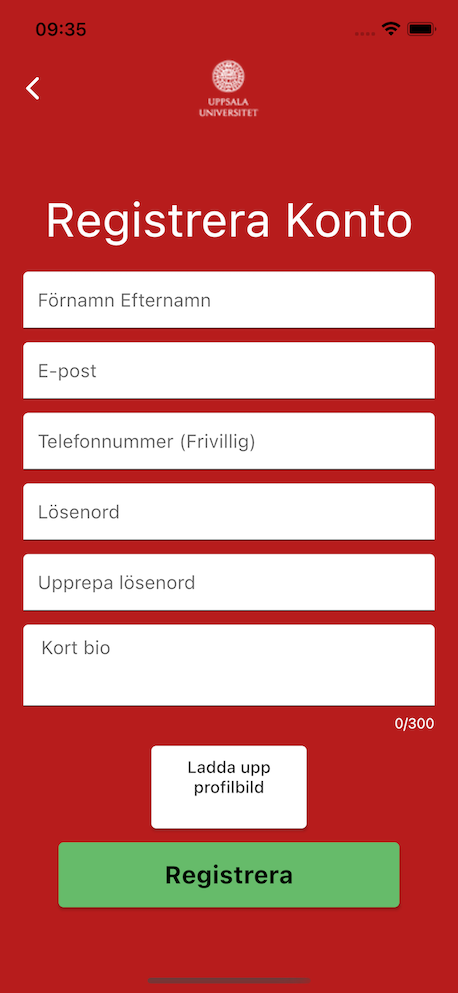
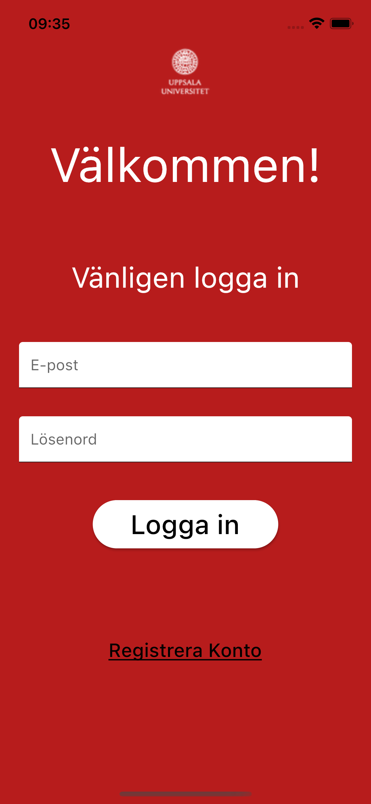
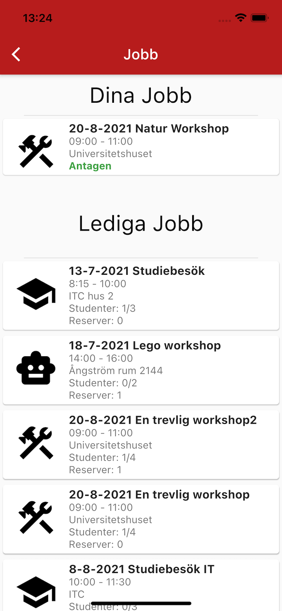
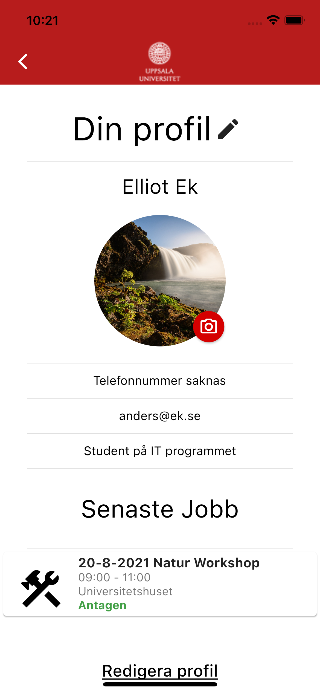
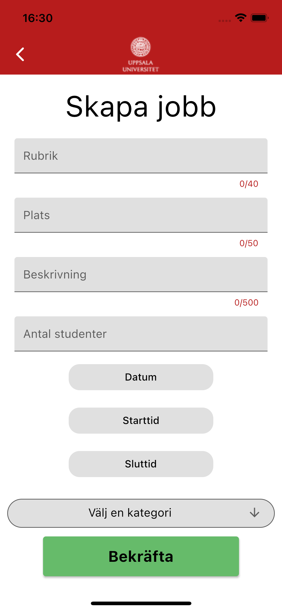
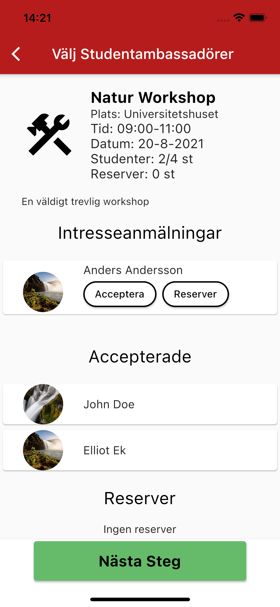

# Stamp
A bachelor thesis project that resulted in a prototype application with a working backend for the ambassador program of the Science and Technology Faculty at Uppsala University. The student ambassador program consists of small jobs that the student ambassadors at the faculty can mark interest for. The application aimed to streamline the process and make it easier to find student ambassadors.

The application can support authentication and authorisation as there are student accounts and administrator accounts with higher privileges. Users can create, edit, and delete their accounts. Student ambassadors can mark interest in the different jobs and the administrator can create jobs and accept students for the different jobs.

# User Interface

 
 
 
 
 
 

# Backend
For the backend Google, Firebase is used. Firebases no-SQL database Cloud Firestore is used for storing user information. Firebase Authentication is used for authentication and authorisation. And Firebase storage is used for storing user profile images.
